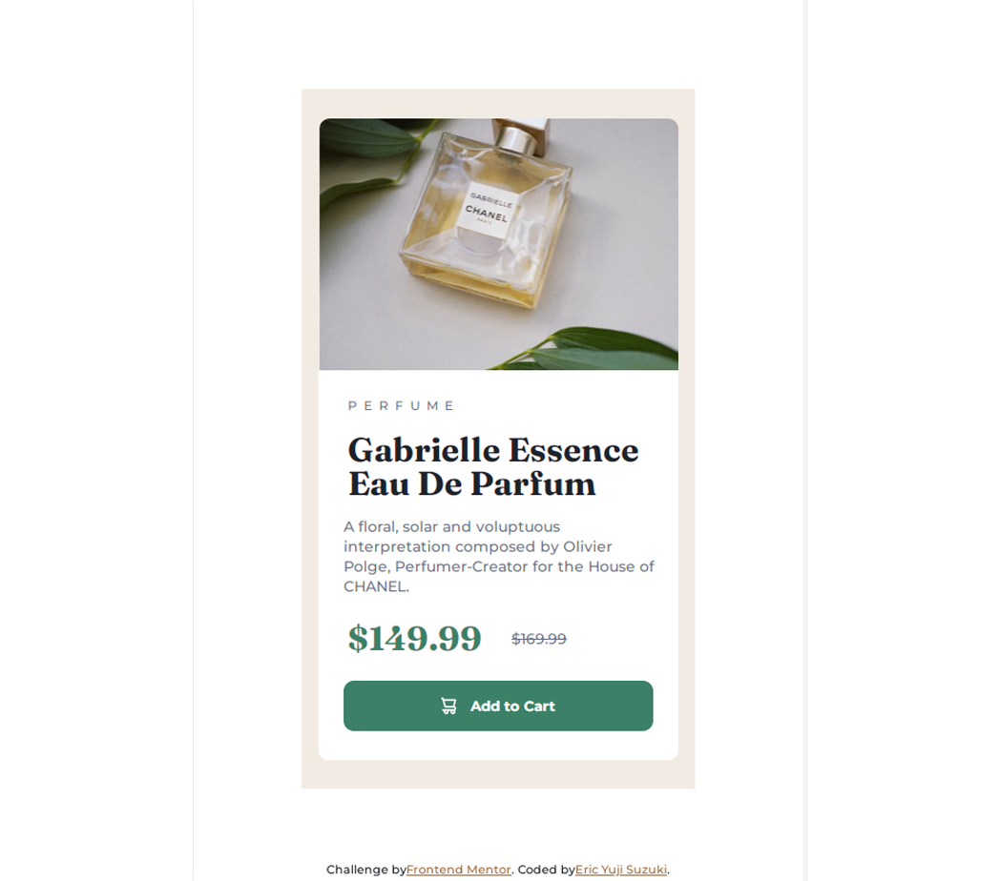

# Frontend Mentor - 02 Product preview card component main

Esta é uma solução do [Product preview card component main do Frontend Mentor](https://www.frontendmentor.io/challenges/product-preview-card-component-GO7UmttRfa). Os desafios do Frontend Mentor ajudam a melhorar suas habilidades de codificação, construindo projetos realistas.

This is a solution to the [Product preview card component main on Frontend Mentor](https://www.frontendmentor.io/challenges/product-preview-card-component-GO7UmttRfa). Frontend Mentor challenges help you improve your coding skills by building realistic projects.

## Sumário (Summary)

- [Frontend Mentor - 02 Product preview card component main](#frontend-mentor---02-product-preview-card-component-main)
  - [Sumário (Summary)](#sumário-summary)
  - [Visão geral (Overview)](#visão-geral-overview)
    - [O desafio (challenge)](#o-desafio-challenge)
    - [Captura de tela (Screenshot)](#captura-de-tela-screenshot)
  - [Meu Processo (My process)](#meu-processo-my-process)
    - [Construído com: (Built with)](#construído-com-built-with)
    - [Oque eu aprendi (What I learned)](#oque-eu-aprendi-what-i-learned)
    - [Aprendizagem (Learning)](#aprendizagem-learning)
  - [Autor (Author)](#autor-author)

## Visão geral (Overview)

### O desafio (challenge)

- O desafio estimula para exercer a prática de oque você aprendeu sobre HTML e CSS.

- The challenge encourages you to practice what you have learned about HTML and CSS.

### Captura de tela (Screenshot)

## Meu Processo (My process)

### Construído com: (Built with)

- Semantic HTML5 markup
- CSS propriedades personalizadas (CSS custom properties)
- CSS flex
- CSS grid
- Esquema de cores (Color Schemes)
- Fluxo de trabalho focado em dispositivos móveis (Mobile-first workflow)

### Oque eu aprendi (What I learned)

Eu gostaria de recapitular algumas das partes principais de aprendizagens deste projeto:

- Utilizar o CSS flex para organizar elementos relacionados em uma página da web.
- Utilização do CSS Grid para organizae os elementos para formato mobile.
- Compreender como usar efetivamente variáveis CSS com cores HSL.
- Implementação do media queries para design responsivo no projeto.

I would like to recap some of the key learnings from this project, which include:

- Using CSS flex to organize related elements on a webpage.
- Using CSS Grid to organize elements for mobile format.
- Understanding how to effectively use CSS variables with HSL colors.
- Implementing media queries for responsive design in the project.

### Aprendizagem (Learning)

Estou estudando na Escola Online Alura sobre Front-End: Html, CSS e Javascript, e em seguida pretendedo estudar Back-End: PHP e Pyhton, para me tornar Fullstack.

I am studying at the Alura Online School on Front-End: HTML, CSS, and JavaScript, and then I plan to study Back-End: PHP and Python, to become a Fullstack developer.

## Autor (Author)

- Frontend Mentor - [@eric-suzuki-dev](https://www.frontendmentor.io/profile/eric-suzuki-dev)
- Github - [Eric Yuji Suzuki](https://github.com/eric-suzuki-dev)